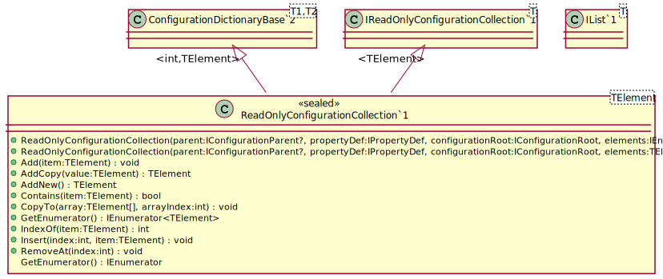
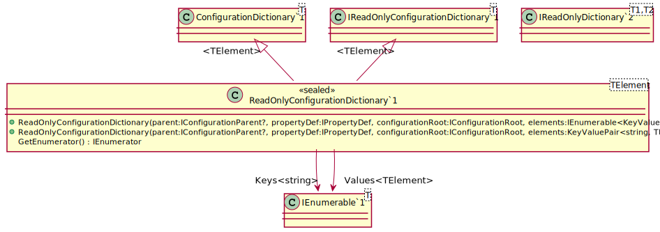

# Properties


The starting point is to define an interface through which to read your 
configuration.  The interface must derive from
[IConfigurationObject](/api/OpenCollar.Extensions.Configuration.IConfigurationObject.md).
The interfaces must be public.  For example:

```cs
public interface IEnvironment : IConfigurationObject
{
    public string EnvironmentName { get; }

    public string Version { get; }
}
public interface IMyConfig : IConfigurationObject
{
    public IEnvironment Environment { get; }

    public string ReadOnlyString { get; }

    public string ReadWriteString { get; }
}
```

## Read-only

To make properties read-only then define only a getter.

### Read-Only Collections

To make a collection read-only use the [IReadOnlyConfigurationCollection](/api/OpenCollar.Extensions.Configuration.IReadOnlyConfigurationCollection-1.html)
interface.




### Read-Only Dictionaries

To make a collection read-only use the [IReadOnlyConfigurationDictionary](/api/OpenCollar.Extensions.Configuration.IReadOnlyConfigurationDictionary-1.html)
interface.



## Read-write

## Configuration Object Values
