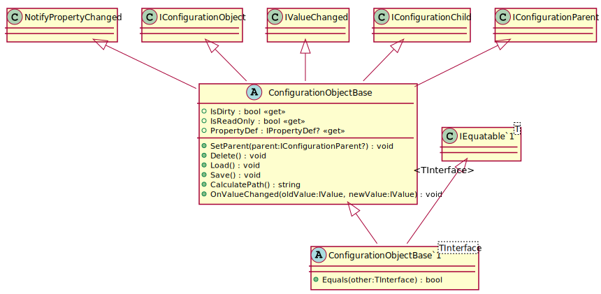
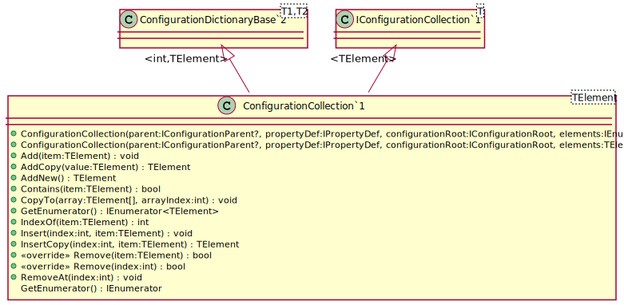
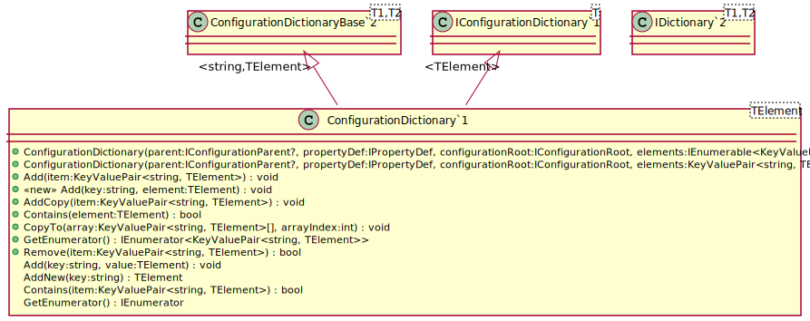

# Collections, Dictionaries and Object

## Configuration Objects

Configuration objects are used to represent simple configuration in the form of an object hierarchy.

## Collections

Collections are configuration objects that represents lists of the configuration
objects or naive values of the same type.  Values are identified by index.

## Dictionaries

Dictionaries are configuration objects represents lists of the configuration
objects or naive values of the same type.  Values are referenced by name.

## "Naive" Types

Any type not derived from [IConfigurationObject](api/OpenCollar.Extensions.Configuration.IConfigurationObject.html)
is considered "naive" and will be serialized as a single value.